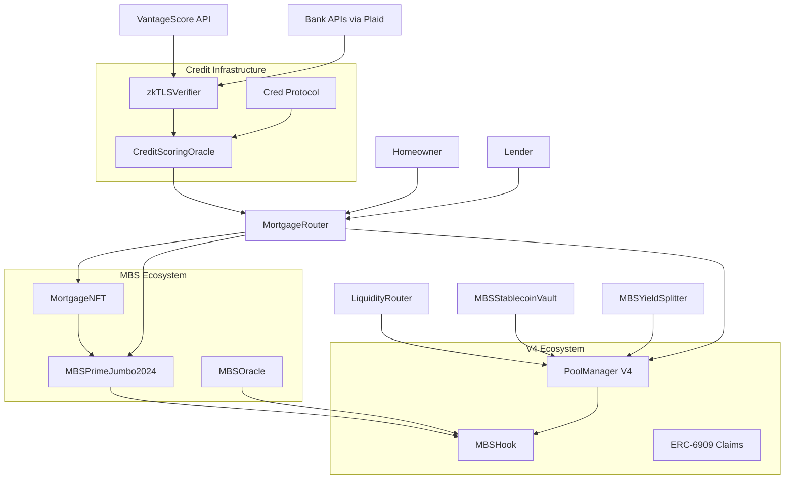

# OriginateX Smart Contract System: Comprehensive Technical Documentation

## Table of Contents
1. [System Architecture Overview](#system-architecture-overview)
2. [Contract Interactions and Data Flow](#contract-interactions-and-data-flow)
3. [Core Contract Analysis](#core-contract-analysis)
4. [Uniswap V4-Specific Features](#uniswap-v4-specific-features)
5. [Security Mechanisms](#security-mechanisms)
6. [Gas Optimization Strategies](#gas-optimization-strategies)
7. [Integration Points](#integration-points)
8. [Developer Implementation Guide](#developer-implementation-guide)

---

## System Architecture Overview

The OriginateX protocol creates a comprehensive decentralized mortgage-backed securities (MBS) platform by bridging traditional real estate finance with DeFi infrastructure. The system leverages Uniswap V4's advanced capabilities to create a sophisticated, oracle-driven marketplace for tokenized mortgages.

### Core Components Architecture



### System Layers

1. **Asset Layer**: `MortgageNFT` - Individual mortgage representation
2. **Securitization Layer**: `MBSPrimeJumbo2024` - Mortgage pooling and tranching
3. **Trading Layer**: `MBSHook` + Uniswap V4 - Oracle-driven market making
4. **Efficiency Layer**: `LiquidityRouter` - Gas-optimized institutional trading
5. **DeFi Integration Layer**: `MBSStablecoinVault`, `MBSYieldSplitter` - Advanced financial products
6. **Credit Assessment Layer**: `CreditScoringOracle` + `zkTLSVerifier` - Multi-dimensional underwriting
7. **Privacy Layer**: zkTLS proofs for confidential data verification without exposure

---

## Contract Interactions and Data Flow

### Phase 1: Mortgage Origination

```solidity
// Funding Flow
Lender.fundMortgage() 
→ MortgageRouter.fundMortgage()
→ USDC.transferFrom(lender, intermediary)
→ MortgageNFT.mint(lender, mortgageDetails)
→ PaymentSchedule storage update
```

**Key Data Structures:**
```solidity
struct MortgageDetails {
    uint256 originalBalance;    // Loan principal in USDC (1e6)
    uint256 interestRateBPS;   // Annual rate (e.g., 550 = 5.50%)
    uint32 termInMonths;       // Loan term
    uint8 ltv;                 // Loan-to-value ratio
    uint8 dti;                 // Debt-to-income ratio
    uint16 fico;               // Credit score
    string loanType;           // "Prime", "Alt-A", "Subprime"
    string amortizationScheme; // Payment structure
}

struct CreditProfile {
    uint256 credProtocolScore;    // On-chain DeFi credit (300-1000)
    uint256 vantageScore;        // Traditional credit (300-850)
    uint256 onChainAssetValue;   // Crypto assets + DeFi positions
    uint256 offChainAssetValue;  // Bank/brokerage assets via zkTLS
    uint256 cashFlowScore;       // Income verification via zkTLS
    uint256 originateXScore;     // Platform-specific payment history
    bytes32 zkProofHash;         // Hash of zkTLS verification proofs
    uint256 lastUpdated;         // Timestamp of last credit update
}
```

### Phase 2: Securitization

```solidity
// Securitization Flow
Investor.securitize()
→ MBSPrimeJumbo2024.securitize(nftTokenId)
→ MortgageNFT.transferFrom(investor, mbsPool)
→ Calculate tranche amounts (70% AAA, 20% BBB, 10% NR)
→ ERC1155.mintBatch([AAA, BBB, NR], amounts)
```

**Tranching Logic:**
```solidity
uint256 aaaAmount = (value * 70) / 100;  // Senior tranche
uint256 bbbAmount = (value * 20) / 100;  // Mezzanine tranche  
uint256 nrAmount = value - aaaAmount - bbbAmount; // Equity tranche
```

### Phase 3: Payment Processing with V4 Flash Accounting

```solidity
// Payment Flow using V4's unlock mechanism
Homeowner.makeMonthlyPayment()
→ MortgageRouter.makeMonthlyPayment()
→ PoolManager.unlock(callbackData)
→ MortgageRouter.unlockCallback()
→ PoolManager.sync() + settle() + donate()
→ Fee distribution across multiple pools
```

**V4 Flash Accounting Benefits:**
- Single transaction for complex multi-pool distributions
- Atomic settlement across all tranche pools
- Gas-efficient batch processing
- No intermediate token transfers

### Phase 4: Secondary Market Trading

```solidity
// Trading Flow with Oracle Pricing
Trader.swap()
→ PoolManager.swap(poolKey, params)
→ MBSHook.beforeSwap()
→ MBSOracle.getPrice() // Real-world pricing
→ Custom AMM calculation
→ BeforeSwapDelta return (overrides V4 pricing)
→ PoolManager.mint/burn ERC-6909 claims
```

---

## Core Contract Analysis

### MortgageRouter: The System Orchestrator

**Purpose**: Central coordination hub for all mortgage operations with V4 integration

**Key Innovations:**
- **Flash Accounting Integration**: Leverages V4's `unlock()` mechanism for capital-efficient operations
- **Multi-Action Support**: Single transaction handling of complex payment distributions
- **Automated Liquidations**: Flash loan-powered liquidation system

**Critical Functions:**

1. **`fundMortgage()`**
```solidity
function fundMortgage(MortgageNFT.MortgageDetails calldata details) 
    external nonReentrant returns (uint256 tokenId)
```
- Transfers USDC from lender to intermediary
- Mints unique MortgageNFT with underwriting data
- Initializes payment schedule with amortization logic
- Returns tokenId for tracking

2. **`makeMonthlyPayment()`**
```solidity
function makeMonthlyPayment(uint256 nftTokenId, uint256 paymentAmount) 
    external nonReentrant
```
- Initiates V4 unlock callback for atomic settlement
- Distributes payments across multiple pools via `donate()`
- Deducts servicing fees transparently
- Updates mortgage balance and payment history

3. **`liquidateMortgage()`**
```solidity
function liquidateMortgage(uint256 nftTokenId, uint256 maxPayment) 
    external nonReentrant
```
- Uses flash loans for capital-efficient liquidations
- Implements 5% liquidation discount mechanism
- Transfers NFT ownership to liquidator
- Atomic settlement via V4 accounting

### MBSHook: Oracle-Driven Market Maker

**Purpose**: Advanced V4 hook implementing oracle-based pricing for MBS tokens

**V4 Hook Capabilities Utilized:**
- `beforeSwap`: Custom pricing logic overriding AMM curves
- `afterSwap`: Reward distribution and volatility tracking
- `beforeInitialize/afterInitialize`: TWAP initialization
- `beforeSwapReturnDelta`: Complete price control

**Security Features:**

1. **Pool Whitelisting System**
```solidity
mapping(bytes32 => bool) public isAllowedPool;
modifier onlyAllowedPool(PoolKey calldata key) {
    require(isAllowedPool[key.toId()], "Pool not authorized");
    _;
}
```
Prevents the Cork protocol attack vector by ensuring only legitimate MBS tokens can be traded.

2. **TWAP Protection**
```solidity
function _getValidatedOraclePrice() internal returns (uint256) {
    uint256 oraclePrice = oracle.getPrice(mbsToken, trancheId);
    uint256 twapPrice = _getTWAPPrice(key);
    uint256 deviation = /* calculate deviation */;
    
    require(deviation <= MAX_PRICE_DEVIATION, "Price manipulation detected");
    return oraclePrice;
}
```

3. **Circuit Breakers**
```solidity
uint256 public constant MAX_DAILY_VOLUME = 10_000_000e6;
function _checkCircuitBreaker(uint256 usdcAmount) internal {
    dailyVolume[today] += usdcAmount;
    require(dailyVolume[today] <= MAX_DAILY_VOLUME, "Daily volume exceeded");
}
```

**Dynamic Fee Mechanism:**
```solidity
function _calculateDynamicFee(bytes32 poolId) internal view returns (uint24) {
    uint256 volatility = volatilityIndex[poolId];
    uint256 fee = BASE_FEE + (volatility * VOLATILITY_MULTIPLIER) / 1000;
    return uint24(fee > MAX_FEE ? MAX_FEE : fee);
}
```

### MBSOracle: Multi-Sig Price Infrastructure

**Purpose**: Secure, role-based price feeding system for MBS valuations

**Security Architecture:**
- **Role-Based Access Control**: `PRICE_UPDATER_ROLE`, `EMERGENCY_ROLE`
- **Price Staleness Protection**: Maximum 1-hour price age
- **Deviation Limits**: 5% maximum single update change
- **Confidence Scoring**: Risk assessment for each price update

**Key Functions:**

1. **`updatePrice()`**
```solidity
function updatePrice(address mbsToken, uint256 trancheId, uint256 newPrice, uint256 confidence)
    external onlyRole(PRICE_UPDATER_ROLE) onlyValidMBSToken(mbsToken) whenNotPaused nonReentrant
```

2. **`getPrice()`** with staleness check
```solidity
function getPrice(address mbsToken, uint256 trancheId) 
    external view returns (uint256 price, uint256 confidence, uint256 timestamp)
```

### LiquidityRouter: Institutional Trading Infrastructure

**Purpose**: Gas-efficient trading for professional market makers using ERC-6909 claims

**V4 Integration:**
- Converts ERC-20/1155 tokens to ERC-6909 claims
- Enables gasless trading through claim burns/mints
- Supports both native ETH and token deposits

**Trading Flow:**
```solidity
// Deposit Phase
deposit() → transferFrom(user, router) → PoolManager.settle() → PoolManager.mint(claims)

// Trading Phase  
User trades with claims → PoolManager.burn(inputClaims) → PoolManager.mint(outputClaims)

// Withdrawal Phase
withdraw() → PoolManager.burn(claims) → PoolManager.take(tokens, user)
```

### MBSYieldSplitter: DeFi Yield Products

**Purpose**: Splits MBS tokens into Principal Tokens (PT) and Yield Tokens (YT) for advanced yield trading

**Key Innovation:**
- Creates separate tradeable instruments for principal and yield
- Enables yield speculation without selling underlying MBS
- Automatic yield distribution to YT holders

**Token ID Generation:**
```solidity
uint256 constant PT_OFFSET = 1e9;  // Principal tokens
uint256 constant YT_OFFSET = 2e9;  // Yield tokens

function getPTTokenId(uint256 mbsTokenId) public pure returns (uint256) {
    return PT_OFFSET + mbsTokenId;
}
```

### MBSStablecoinVault: Collateralized Stablecoin

**Purpose**: Issues `dMBS-USD` stablecoin backed by locked MBS ERC-6909 claims

**Mechanism:**
1. Users lock ERC-6909 MBS claims in vault
2. Vault mints equivalent `dMBS-USD` stablecoin
3. Users can burn stablecoin to unlock claims
4. Provides additional liquidity and utility for MBS tokens

### CreditScoringOracle: Multi-Dimensional Credit Assessment

**Purpose**: Combines on-chain and off-chain credit data for comprehensive borrower evaluation

**Credit Data Sources:**
1. **On-Chain Data (via Cred Protocol)**: DeFi transaction history, loan repayments, liquidations
2. **Traditional Credit (via zkTLS)**: VantageScore 3.0 from Credit Karma without SSN exposure
3. **Asset Verification (via zkTLS)**: Bank balances, brokerage accounts, crypto holdings
4. **Income Verification (via zkTLS)**: Employment records, cash flows, recurring deposits
5. **Platform History**: OriginateX-specific payment performance and reputation

**zkTLS Privacy Architecture:**
```solidity
contract zkTLSVerifier {
    struct ProofData {
        bytes32 dataHash;         // Hash of verified data
        bytes proof;              // zkTLS proof
        address verifier;         // Trusted verifier
        uint256 timestamp;        // Verification timestamp
        bool isValid;             // Proof validity status
    }
    
    function verifyCredential(
        address user,
        bytes32 dataType,        // "credit_score", "bank_balance", "income"
        bytes calldata proof
    ) external returns (bool) {
        // Verify zkTLS proof without exposing raw data
        require(verifyProof(proof), "Invalid zkTLS proof");
        
        // Store proof hash for future reference
        proofData[user][dataType] = ProofData({
            dataHash: keccak256(proof),
            proof: proof,
            verifier: msg.sender,
            timestamp: block.timestamp,
            isValid: true
        });
        
        return true;
    }
}
```

**Dynamic Interest Rate Calculation:**
```solidity
function calculateInterestRate(address borrower) external view returns (uint256) {
    CreditProfile memory profile = creditProfiles[borrower];
    
    // Base rate from market conditions
    uint256 baseRate = 450; // 4.50% base
    
    // Risk adjustments based on credit factors
    uint256 creditRisk = 0;
    
    // Traditional credit score impact (30% weight)
    if (profile.vantageScore >= 780) {
        creditRisk += 0; // Excellent credit - no additional risk
    } else if (profile.vantageScore >= 740) {
        creditRisk += 25; // Good credit - 0.25% premium
    } else if (profile.vantageScore >= 680) {
        creditRisk += 75; // Fair credit - 0.75% premium
    } else {
        creditRisk += 150; // Poor credit - 1.50% premium
    }
    
    // On-chain credit history (25% weight)
    if (profile.credProtocolScore >= 850) {
        creditRisk -= 25; // Excellent DeFi history - discount
    } else if (profile.credProtocolScore <= 500) {
        creditRisk += 50; // Poor DeFi history - premium
    }
    
    // Asset-to-loan ratio impact (20% weight)
    uint256 totalAssets = profile.onChainAssetValue + profile.offChainAssetValue;
    uint256 assetRatio = (totalAssets * 100) / loanAmount;
    if (assetRatio >= 300) {
        creditRisk -= 50; // Strong asset backing - discount
    } else if (assetRatio <= 100) {
        creditRisk += 100; // Weak asset backing - premium
    }
    
    // Platform reputation (25% weight)
    if (profile.originateXScore >= 950) {
        creditRisk -= 25; // Excellent platform history - discount
    } else if (profile.originateXScore <= 700) {
        creditRisk += 50; // Poor platform history - premium
    }
    
    return baseRate + creditRisk;
}
```

### zkTLSVerifier: Privacy-Preserving Data Verification

**Purpose**: Enables secure verification of off-chain financial data without exposing sensitive information

**Key Features:**
1. **Zero-Knowledge Proofs**: Verify data authenticity without revealing actual values
2. **Selective Disclosure**: Only prove specific assertions (e.g., "income > $80K") 
3. **No SSN Required**: Eliminates need for traditional hard credit pulls
4. **Tamper-Proof**: Cryptographic proofs prevent data manipulation

---

## Uniswap V4-Specific Features

### Flash Accounting (Delta Resolution)

**Traditional vs V4 Approach:**
```solidity
// Traditional (multiple transactions)
1. Transfer tokens to contract
2. Process logic
3. Transfer tokens out
4. Repeat for each action

// V4 Flash Accounting (single transaction)
1. PoolManager.unlock() starts transaction
2. Multiple operations create deltas
3. All deltas resolved atomically at end
4. Net settlement only
```

**Implementation in MortgageRouter:**
```solidity
function unlockCallback(bytes calldata rawData) external returns (bytes memory) {
    // 1. Decode action type
    CallbackData memory data = abi.decode(rawData, (CallbackData));
    
    // 2. Execute complex multi-step logic
    if (data.action == Action.MAKE_PAYMENT) {
        // Multiple pool operations in single transaction
        poolManager.sync(usdc);
        poolManager.settle(usdc);
        for (uint256 i = 0; i < poolCount; i++) {
            poolManager.donate(distributionPools[i], amount, 0, hookData);
        }
        poolManager.take(usdc, intermediary, servicingFee);
    }
    
    // 3. Return settlement delta
    return abi.encode(BalanceDeltaLibrary.ZERO_DELTA);
}
```

### ERC-6909 Claim System

**Advantages for Institutional Trading:**
- **Gas Efficiency**: No external transfers during trades
- **Capital Efficiency**: No need to pre-fund trading accounts
- **Composability**: Claims can be used across multiple pools
- **Atomic Operations**: Complex trades execute in single transaction

**Implementation Pattern:**
```solidity
// Deposit: ERC-20 → ERC-6909 Claims
function deposit(Currency currency, uint256 amount) external {
    IERC20Minimal(Currency.unwrap(currency)).transferFrom(msg.sender, address(this), amount);
    poolManager.unlock(abi.encode(CallbackData({
        action: Action.DEPOSIT,
        user: msg.sender,
        currency: currency,
        amount: amount
    })));
}

// Trade: Claim → Claim (no external transfers)
function swap() {
    // PoolManager automatically burns input claims, mints output claims
}

// Withdraw: ERC-6909 Claims → ERC-20
function withdraw(Currency currency, uint256 amount) external {
    poolManager.unlock(abi.encode(CallbackData({
        action: Action.WITHDRAW,
        user: msg.sender,
        currency: currency,
        amount: amount
    })));
}
```

### Custom Hook Architecture

**Hook Permission Matrix:**
```solidity
function getHookPermissions() public pure override returns (Hooks.Permissions memory) {
    return Hooks.Permissions({
        beforeInitialize: true,       // Initialize TWAP
        afterInitialize: true,        // Setup pool parameters
        beforeAddLiquidity: true,     // Restrict direct liquidity
        beforeRemoveLiquidity: true,  // Restrict direct liquidity
        beforeSwap: true,             // Custom pricing logic
        afterSwap: true,              // Reward distribution
        beforeSwapReturnDelta: true,  // Override AMM pricing
        // ... other permissions set to false
    });
}
```

**Custom Pricing Override:**
```solidity
function beforeSwap(...) external override returns (bytes4, BeforeSwapDelta, uint24) {
    // 1. Get oracle price (real-world valuation)
    uint256 oraclePrice = _getValidatedOraclePrice(mbsToken, trancheId, key);
    
    // 2. Calculate swap amounts based on oracle, not AMM curve
    (uint256 amountIn, uint256 amountOut) = _calculateSwapAmounts(params, oraclePrice);
    
    // 3. Execute swap through ERC-6909 operations
    if (params.zeroForOne) {
        poolManager.mint(key.currency0, address(this), amountIn);
        poolManager.burn(key.currency1, address(this), amountOut);
    } else {
        poolManager.mint(key.currency1, address(this), amountIn);
        poolManager.burn(key.currency0, address(this), amountOut);
    }
    
    // 4. Return custom delta (overrides V4 AMM)
    BeforeSwapDelta returnDelta = toBeforeSwapDelta(
        -int128(int256(amountIn)),
        int128(int256(amountOut))
    );
    
    return (this.beforeSwap.selector, returnDelta, dynamicFee);
}
```

### Transient Storage Optimization

**Gas Optimization using Transient Storage:**
```solidity
// Store temporary data in transient storage (EIP-1153)
bytes32 constant TEMP_AMOUNT_IN_SLOT = bytes32(uint256(keccak256("mbs.hook.temp.amountIn")) - 1);

function _storeTransient(bytes32 slot, uint256 value) internal {
    assembly {
        tstore(slot, value)  // Cheaper than SSTORE
    }
}

function _loadTransient(bytes32 slot) internal view returns (uint256 value) {
    assembly {
        value := tload(slot)  // Cheaper than SLOAD
    }
}
```

---

## Security Mechanisms

### Pool Whitelisting Defense

**Attack Vector Prevention:**
```solidity
// Prevents Cork-style attacks where malicious pools exploit legitimate hooks
mapping(bytes32 => bool) public isAllowedPool;

function allowPool(PoolKey calldata key) external onlyOwner {
    // Verify pool configuration
    require(key.hooks == IHooks(address(this)), "Invalid hook");
    require(
        Currency.unwrap(key.currency0) == oracle.USDC_ADDRESS() || 
        Currency.unwrap(key.currency1) == oracle.USDC_ADDRESS(),
        "Must include USDC"
    );
    
    isAllowedPool[key.toId()] = true;
}
```

### Oracle Security Architecture

**Multi-Layer Protection:**
1. **Role-Based Access**: Only authorized updaters can modify prices
2. **Deviation Limits**: Maximum 5% price changes per update
3. **Staleness Protection**: Prices expire after 1 hour
4. **Confidence Scoring**: Each price includes reliability metric

```solidity
struct PriceData {
    uint256 price;          // Price in USDC (18 decimals)
    uint256 timestamp;      // Last update timestamp
    uint256 confidence;     // Confidence score (0-10000 basis points)
    address updater;        // Who updated the price
}
```

### Circuit Breaker System

**Volume-Based Protection:**
```solidity
uint256 public constant MAX_DAILY_VOLUME = 10_000_000e6; // $10M daily limit

function _checkCircuitBreaker(uint256 usdcAmount) internal {
    uint256 today = block.timestamp / 1 days;
    dailyVolume[today] += usdcAmount;
    
    if (dailyVolume[today] > MAX_DAILY_VOLUME) {
        emit CircuitBreakerTriggered(dailyVolume[today], MAX_DAILY_VOLUME);
        revert("Daily volume limit exceeded");
    }
}
```

### Reentrancy Protection

**OpenZeppelin Integration:**
```solidity
import {ReentrancyGuard} from "@openzeppelin/contracts/security/ReentrancyGuard.sol";

contract MortgageRouter is IUnlockCallback, Ownable, ReentrancyGuard {
    function fundMortgage(...) external nonReentrant returns (uint256) {
        // Protected against reentrancy attacks
    }
    
    function makeMonthlyPayment(...) external nonReentrant {
        // Protected against reentrancy attacks
    }
}
```

---

## Gas Optimization Strategies

### 1. V4 Flash Accounting

**Before (Traditional):**
```solidity
// Multiple transactions, each with gas overhead
Transfer 1: USDC → Contract (21,000 gas)
Transfer 2: Contract → Pool A (21,000 gas)  
Transfer 3: Contract → Pool B (21,000 gas)
Transfer 4: Contract → Servicer (21,000 gas)
Total: 84,000+ gas
```

**After (V4 Flash Accounting):**
```solidity
// Single transaction with net settlement
unlock() {
    sync() + settle() + donate() + donate() + take()
    // Net settlement only, ~40,000 gas total
}
```

### 2. ERC-6909 Claims Trading

**Traditional Token Trading:**
```solidity
// Each trade requires external transfers
1. approve() - 46,000 gas
2. transferFrom() - 23,000 gas  
3. Pool logic - 20,000 gas
Total: 89,000 gas per trade
```

**ERC-6909 Claims Trading:**
```solidity
// Only internal accounting updates
1. burn(inputClaims) - 5,000 gas
2. mint(outputClaims) - 5,000 gas
3. Pool logic - 20,000 gas
Total: 30,000 gas per trade (67% reduction)
```

### 3. Transient Storage Usage

**Temporary Data Storage:**
```solidity
// Traditional storage (expensive)
uint256 tempAmount; // 20,000 gas SSTORE

// Transient storage (EIP-1153)
assembly {
    tstore(slot, value) // 100 gas TSTORE
}
```

### 4. Batch Operations

**Batch Payment Processing:**
```solidity
function makeBatchPayments(uint256[] calldata nftTokenIds, uint256[] calldata amounts) 
    external nonReentrant 
{
    // Single unlock() call processes multiple payments
    // Amortizes gas overhead across multiple operations
    poolManager.unlock(abi.encode(BatchPaymentData({
        sender: msg.sender,
        nftTokenIds: nftTokenIds,
        amounts: amounts
    })));
}
```

### 5. Optimized Data Structures

**Packed Structs:**
```solidity
struct PaymentSchedule {
    uint256 monthlyPayment;    // 32 bytes
    uint256 lastPaymentDate;   // 32 bytes
    uint256 missedPayments;    // 32 bytes - could be uint8
    bool isActive;             // 32 bytes - could be packed
}

// Optimized version:
struct PaymentSchedule {
    uint256 monthlyPayment;      // 32 bytes
    uint256 lastPaymentDate;     // 32 bytes  
    uint8 missedPayments;        // 1 byte
    bool isActive;               // 1 byte
    // 30 bytes saved per struct
}
```

---

## Integration Points

### External Protocol Integrations

1. **Uniswap V4 PoolManager**
   - Core trading infrastructure
   - ERC-6909 claim management
   - Flash accounting system

2. **OpenZeppelin Contracts**
   - Access control (roles and ownership)
   - Security (reentrancy guards)
   - Token standards (ERC-721, ERC-1155, ERC-20)

3. **Chainlink Oracle Network** (Future)
   - Decentralized price feeds
   - Property valuation data
   - Interest rate information

### Off-Chain Integrations

1. **SPV & Trust Manager**
   - Legal entity holding property liens
   - Fiat currency conversion
   - Regulatory compliance

2. **Custodian Banking**
   - Traditional banking interfaces
   - Wire transfer processing
   - Cash management

3. **Property Registries**
   - Government deed recording
   - Lien management
   - Legal documentation

### API Integration Points

**Smart Contract Events for External Systems:**
```solidity
event MortgageFunded(address indexed lender, uint256 indexed nftTokenId, uint256 amount);
event PaymentMade(address indexed obligor, uint256 indexed nftTokenId, uint256 amount);
event MortgageLiquidated(uint256 indexed nftTokenId, address indexed liquidator);
event PriceUpdated(address indexed mbsToken, uint256 indexed trancheId, uint256 price);
```

**Web3 Integration Patterns:**
```javascript
// Frontend integration example
const mortgageRouter = new ethers.Contract(address, abi, signer);

// Fund mortgage
const tx = await mortgageRouter.fundMortgage({
    originalBalance: ethers.utils.parseUnits("500000", 6), // 500k USDC
    interestRateBPS: 550, // 5.50%
    termInMonths: 360,
    ltv: 80,
    dti: 35,
    fico: 780,
    loanType: "Prime",
    amortizationScheme: "FullyAmortizing"
});
```

---

## Developer Implementation Guide

### Setup and Deployment

1. **Environment Setup**
```bash
# Install Foundry
curl -L https://foundry.paradigm.xyz | bash
foundryup

# Clone and build
git clone [repository]
cd originatex/apps/passthru-protocol
forge build
```

2. **Testing**
```bash
# Run comprehensive tests
forge test -vvv

# Gas reporting
forge test --gas-report
```

3. **Deployment Sequence**
```solidity
// 1. Deploy core infrastructure
MockERC20 usdc = new MockERC20("USD Coin", "USDC", 6);
MBSOracle oracle = new MBSOracle();

// 2. Deploy V4 PoolManager (or use existing)
PoolManager poolManager = new PoolManager();

// 3. Deploy MBS contracts
MortgageNFT mortgageNFT = new MortgageNFT(owner);
MBSPrimeJumbo2024 mbsPool = new MBSPrimeJumbo2024(owner, address(mortgageNFT));

// 4. Deploy router with dependencies
MortgageRouter router = new MortgageRouter(
    address(poolManager),
    address(mortgageNFT), 
    address(mbsPool),
    address(oracle),
    address(usdc),
    intermediary
);

// 5. Link contracts
mortgageNFT.setRouter(address(router));

// 6. Deploy hook with mining
address hookAddress = /* mine hook address with correct flags */;
MBSHook hook = MBSHook(hookAddress);

// 7. Deploy utility contracts
LiquidityRouter liquidityRouter = new LiquidityRouter(address(poolManager));
```

### Integration Patterns

**Basic Mortgage Funding:**
```solidity
// 1. Approve USDC spending
IERC20(usdc).approve(mortgageRouter, loanAmount);

// 2. Fund mortgage
uint256 tokenId = mortgageRouter.fundMortgage(mortgageDetails);

// 3. Receive MortgageNFT
assert(mortgageNFT.ownerOf(tokenId) == msg.sender);
```

**Securitization:**
```solidity
// 1. Approve NFT transfer
mortgageNFT.approve(mbsPool, tokenId);

// 2. Securitize
mbsPool.securitize(tokenId);

// 3. Receive tranched tokens
uint256 aaaBalance = mbsPool.balanceOf(msg.sender, mbsPool.AAA_TRANCHE_ID());
```

**Trading Setup:**
```solidity
// 1. Create pool
PoolKey memory poolKey = PoolKey({
    currency0: Currency.wrap(address(usdc)),
    currency1: Currency.wrap(address(mbsPool)),
    fee: 3000,
    tickSpacing: 60,
    hooks: IHooks(address(mbsHook))
});

// 2. Whitelist pool
mbsHook.allowPool(poolKey);

// 3. Initialize with oracle price
uint160 sqrtPriceX96 = /* calculate from oracle price */;
poolManager.initialize(poolKey, sqrtPriceX96);
```

### Error Handling

**Common Error Patterns:**
```solidity
// Pool not whitelisted
error: "Pool not authorized"
// Solution: Call mbsHook.allowPool(poolKey)

// Stale oracle price  
error: "Price too stale"
// Solution: Update oracle price within MAX_PRICE_AGE

// Insufficient payment
error: "Payment too small"  
// Solution: Ensure payment >= MIN_PAYMENT_AMOUNT

// Circuit breaker triggered
error: "Daily volume limit exceeded"
// Solution: Wait for next day or increase limit
```

### Performance Monitoring

**Key Metrics to Track:**
```solidity
// Gas usage per operation
- Mortgage funding: ~200,000 gas
- Payment processing: ~150,000 gas  
- Trading with hook: ~120,000 gas
- Claim trading: ~45,000 gas

// Volume metrics
- Daily trading volume vs limits
- Total value locked (TVL)
- Payment success rates
- Liquidation frequencies
```

### Security Checklist

**Pre-Deployment Verification:**
- [ ] All contracts audited by reputable firm
- [ ] Oracle price feeds tested with various scenarios
- [ ] Hook permissions configured correctly  
- [ ] Pool whitelisting implemented and tested
- [ ] Circuit breakers calibrated appropriately
- [ ] Emergency pause mechanisms functional
- [ ] Role-based access controls verified
- [ ] Reentrancy protections in place

**Operational Security:**
- [ ] Multi-sig setup for admin functions
- [ ] Oracle price updater roles distributed
- [ ] Emergency response procedures documented
- [ ] Monitoring systems for unusual activity
- [ ] Regular security parameter reviews

---

## Conclusion

The OriginateX smart contract system represents a sophisticated integration of traditional mortgage finance with cutting-edge DeFi infrastructure. By leveraging Uniswap V4's advanced features—particularly flash accounting, ERC-6909 claims, and custom hooks—the platform achieves institutional-grade efficiency while maintaining the transparency and composability that DeFi enables.

The system's modular architecture allows for independent upgrades and extensions while maintaining security through comprehensive whitelisting, oracle validation, and circuit breaker mechanisms. The integration of real-world asset backing with on-chain liquidity creates a bridge between traditional finance and DeFi that could serve as a model for other asset tokenization projects.

For developers implementing similar systems, the key innovations to consider are:

1. **V4 Flash Accounting** for capital-efficient multi-step operations
2. **Oracle-Driven Pricing** to ensure real-world asset valuations
3. **ERC-6909 Claims** for institutional-grade trading efficiency  
4. **Comprehensive Security** through whitelisting and circuit breakers
5. **Modular Architecture** for future extensibility and upgrades

This technical foundation provides the infrastructure needed to bring traditional mortgage markets on-chain while maintaining the security, efficiency, and regulatory compliance required for institutional adoption.